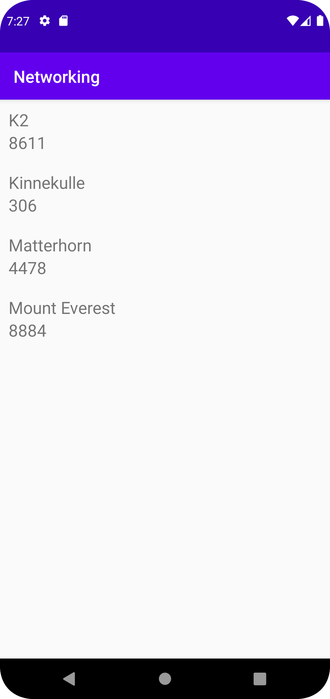

## Skapandet av RecyclerView:
- Jag började med att skapa en RecyclerView inom min activity_main.xml som följande:

```
    <androidx.recyclerview.widget.RecyclerView
        android:id="@+id/recyler_view"
        android:layout_width="match_parent"
        android:layout_height="match_parent"
        app:layout_constraintStart_toStartOf="parent"
        app:layout_constraintEnd_toEndOf="parent"
        app:layout_constraintTop_toBottomOf="parent"
        app:layout_constraintBottom_toTopOf="parent"
        />
```

## Skapandet av items till min RecyclerView:
- Sedan skapade jag en XML-fil som skall styla mina items inom den skapade RecyclerView som följande:
```
    <TextView
        android:id="@+id/name"
        android:layout_width="wrap_content"
        android:layout_height="wrap_content"
        app:layout_constraintTop_toTopOf="parent"
        app:layout_constraintStart_toStartOf="parent"
        android:textSize="20sp"
        />
```
## Hämtandet av RecyclerView i MainActivity.java
- Sedan så hämtade jag den i min MainActivity.java genom att skapa "private RecyclerView RecyclerView" 
  samt hänvisa till den inom in XML fil som följande:
```
        RecyclerView = findViewById(R.id.recyler_view);
```

## Tilldelning av adapter, skapande av ArrayList samt LayoutManager
- Här tog jag tillfället i akt att skapa den ArrayList som kommer att innehålla all material som skall presenteras, 
  samt skapa en ny adapter, tilldela den till min RecyclerView samt tillfoga en LineraLayoutManager.
```
        listOfMountains = new ArrayList<Mountains>();
        adapter = new MyAdapter(listOfMountains);
        RecyclerView.setAdapter(adapter);
        RecyclerView.setLayoutManager(new LinearLayoutManager(this));
```

## Hanteringen av GSON / JSON
- Eftersom att jag redan återfann mig i MainActivity.java så passade jag på att skapa ett GSON objekt för att genomföra den "Unmarshalled Operation",
Sedan skapade jag en Type type och följde den tilldelade koden från Canvas, "JSON - Parse JSON using GSON library".
Denna datan tilldelade jag därmed till den Arrayen som skall presenteras, genom "addAll" från det givna resultatet.
```
        Gson gson = new Gson();
        Type type = new TypeToken<ArrayList<Mountains>>() {}.getType();
        ArrayList<Mountains> lista = gson.fromJson(json, type);
        listOfMountains.addAll(lista);
        adapter.notifyDataSetChanged();
```          
 
##  Skapandet av min "Mountains"
- Min Mountains.java skapade jag här då denna är något jag fann enkelt att komma ihåg, då jag bara kan generera getters samt setters automatiskt.
Denna blev som följande då jag valde att endast presentera namnet samt storleken på dom givna bergen:
```
public class Mountains {
    private String name;
    private int size;

    public Mountains(String name, int size) {
        this.name = name;
        this.size = size;
    }

    public String getName() {
        return name;
    }

    public void setName(String name) {
        this.name = name;
    }

    public int getSize() {
        return size;
    }

    public void setSize(int size) {
        this.size = size;
    }
}
```
## Skapandet av ViewHolder
- Skapandet av denna baserade jag mycket på den assistans vi fick vid den repitering som skedde, där förklaring för en ViewHolders funktion dök upp,
inom denna har jag åter igen bara "Name" samt "Size" då dessa är dom enda två intressanta variablerna att presentera för bergen. 
  
```
public class MyViewHolder extends RecyclerView.ViewHolder {
    public TextView name;
    public TextView size;

    public MyViewHolder(@NonNull View itemView) {
        super(itemView);
        name = itemView.findViewById(R.id.name);
        size = itemView.findViewById(R.id.size);
    }
}
```
- Denna är alltså väldigt kort, vad den endast gör är tar in en TextView för name samt size, och hämtar sedan dom två ID från min xml-fil som innehåller
datan om alla items som kommer komma att presenteras, och tilldelar dessa till sina egna variabler.


## Skapandet av Adapter
- Det jag gjort än så länge tillför inte mycket alls för tillfället men nu kan jag röra mig vidare till min Adapter,
som jag genererade automatiskt från det felmeddelandet som uppkommer vid mitt tilldelande av en adapter till RecyclerView inom min MainActivity.java,
Denna baserades även primärt på dom informativa kodexemplen som presenteras på Canvas.
  
```
public class MyAdapter extends RecyclerView.Adapter<MyViewHolder> {
    private List<Mountains> listOfMountains;
    public MyAdapter(List<Mountains> listOfMountains) {
        this.listOfMountains = listOfMountains;
    }

    @NonNull
    @Override
    public MyViewHolder onCreateViewHolder(@NonNull ViewGroup parent, int viewType) {
        View view = LayoutInflater.from(parent.getContext()).inflate(R.layout.recyclerview_items, parent, false);
        return new MyViewHolder(view);
    }

    @Override
    public void onBindViewHolder(@NonNull MyViewHolder holder, int position) {
            holder.name.setText(listOfMountains.get(position).getName());
            holder.size.setText(String.valueOf(listOfMountains.get(position).getSize()));
    }

    @Override
    public int getItemCount() {
        return listOfMountains.size();
    }
}
```
- Här ser vi alltså skapandet av Adaptern, onCreateViewHolder, onBindViewHolder samt getItemCount
genererades automatiskt, samt med den "extends RecylerView.Adapter<MyViewHolder>" som krävs för att detta skall fungera. Denna bit är förvirrande genom ett konstant bruk av samma namn,
nämligen "listOfMountains", men mycket av dom kreativa variabelnamnen kommer från den första genomgången av en RecyclerView.   

## Slutliga fixer

- Vad jag sedan gjorde för att koppla ihop allt detta är att byta ut innehållet av variabeln JSON_URL till den tilldelade länken,
samt ändrade "new JsonFile" till "new JsonTask" samt "execute(JSON_FILE)" till "execute(JSON_URL)". Jag gav även applikationen tillgång till internet genom
en simpel uses-permission inom AndroidManifest.xml
 

Bilder läggs i samma mapp som markdown-filen.


